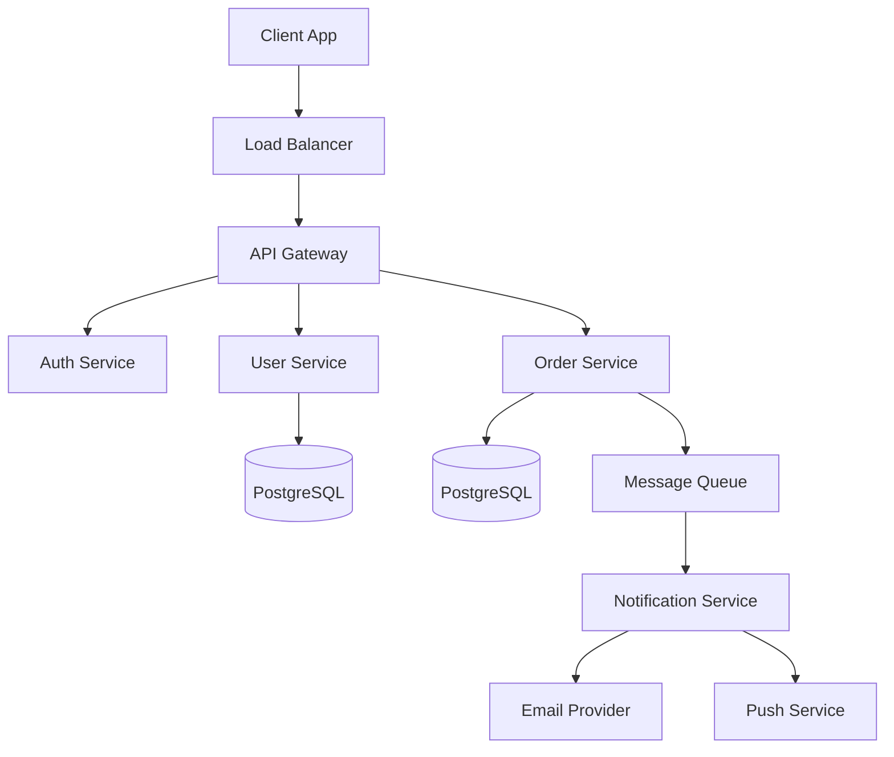
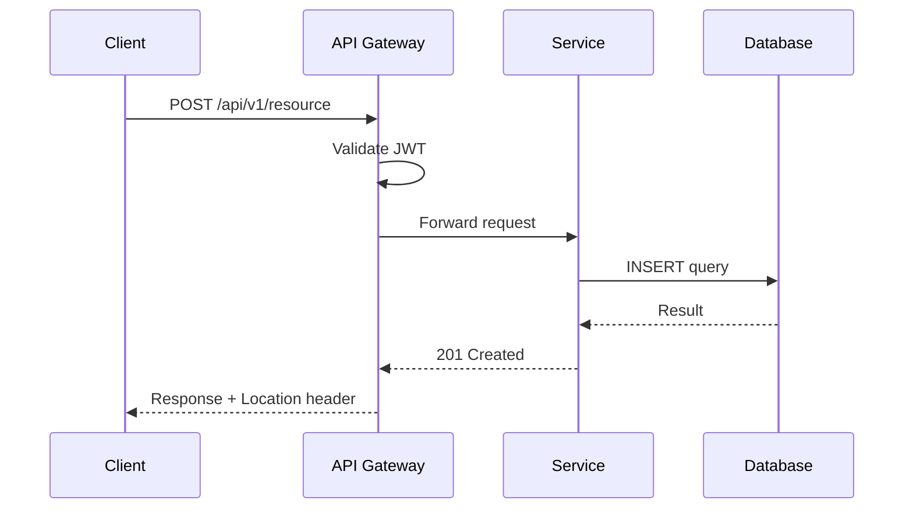
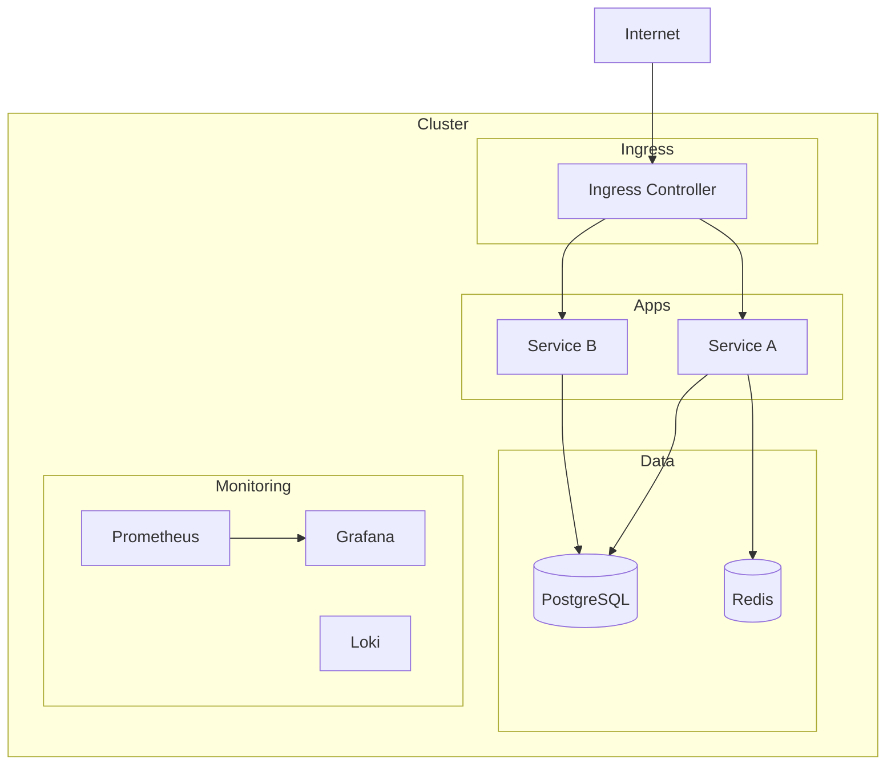
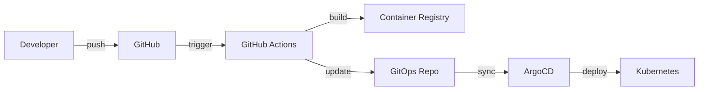

# API Documentation & Architecture Diagrams

> **TL;DR**: Templates for OpenAPI specs, Mermaid architecture diagrams, k8s manifest documentation, and system design docs.

## OpenAPI / Swagger Spec

### Template
```yaml
openapi: 3.0.3
info:
  title: [Service Name] API
  description: [Brief description]
  version: 1.0.0
  contact:
    name: [Team Name]

servers:
  - url: https://api.example.com/v1
    description: Production
  - url: https://staging-api.example.com/v1
    description: Staging

paths:
  /resources:
    get:
      summary: List resources
      operationId: listResources
      tags: [Resources]
      parameters:
        - name: page
          in: query
          schema:
            type: integer
            default: 1
        - name: limit
          in: query
          schema:
            type: integer
            default: 20
            maximum: 100
      responses:
        '200':
          description: Successful response
          content:
            application/json:
              schema:
                $ref: '#/components/schemas/ResourceList'
        '401':
          $ref: '#/components/responses/Unauthorized'

    post:
      summary: Create resource
      operationId: createResource
      tags: [Resources]
      requestBody:
        required: true
        content:
          application/json:
            schema:
              $ref: '#/components/schemas/CreateResourceRequest'
      responses:
        '201':
          description: Resource created
        '400':
          $ref: '#/components/responses/BadRequest'

components:
  schemas:
    Resource:
      type: object
      required: [id, name, created_at]
      properties:
        id:
          type: string
          format: uuid
        name:
          type: string
          maxLength: 255
        created_at:
          type: string
          format: date-time

  responses:
    Unauthorized:
      description: Authentication required
      content:
        application/json:
          schema:
            $ref: '#/components/schemas/Error'
    BadRequest:
      description: Invalid request
      content:
        application/json:
          schema:
            $ref: '#/components/schemas/Error'

  securitySchemes:
    bearerAuth:
      type: http
      scheme: bearer
      bearerFormat: JWT

security:
  - bearerAuth: []
```

### Cursor Agent Prompt
```
Generate an OpenAPI 3.0 spec for [service name].

Endpoints:
- [GET /resource - list with pagination]
- [POST /resource - create]
- [GET /resource/{id} - get by ID]
- [PUT /resource/{id} - update]
- [DELETE /resource/{id} - delete]

Use the template format from @file:resources/document-creation/api-and-diagrams.md
Include proper error responses, authentication, and example values.
```

---

## Mermaid Architecture Diagrams

### System Architecture


### Sequence Diagram


### Kubernetes Architecture


### GitOps Flow


---

## Kubernetes Manifest Documentation

### Template
```markdown
# [Resource Name] — Kubernetes Manifest Documentation

## Overview
[What this manifest deploys and why]

## Resources
| Resource | Name | Namespace | Purpose |
|----------|------|-----------|---------|
| Deployment | [name] | [ns] | [purpose] |
| Service | [name] | [ns] | [purpose] |
| ConfigMap | [name] | [ns] | [purpose] |
| Secret | [name] | [ns] | [purpose] |

## Configuration
| Parameter | Default | Description |
|-----------|---------|-------------|
| replicas | 3 | Number of pod replicas |
| resources.cpu | 100m/500m | CPU request/limit |
| resources.memory | 128Mi/512Mi | Memory request/limit |

## Dependencies
- [database service]
- [cache service]
- [config maps / secrets]

## Health Checks
- Liveness: HTTP GET /healthz (port 8080)
- Readiness: HTTP GET /readyz (port 8080)

## Scaling
- HPA: min 2, max 10, target CPU 70%
```

---

## "Use this when..."

| Scenario | Document |
|----------|----------|
| Designing a new API | OpenAPI spec |
| Documenting system architecture for onboarding | Mermaid diagram |
| Planning a Kubernetes deployment | K8s manifest docs |
| Communicating service interactions | Sequence diagram |
| Visualizing GitOps pipeline | Flow diagram |
