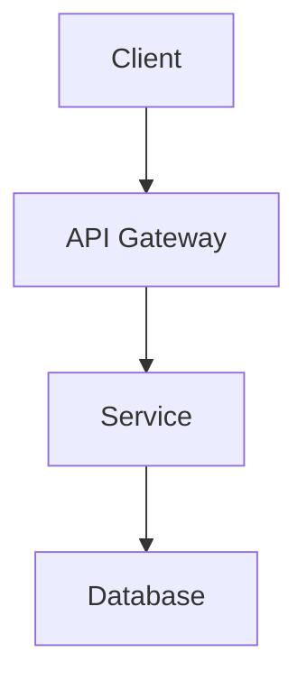

# PRD, Tech Specs & Architecture Decision Records

> **TL;DR**: Templates for Product Requirements Documents, technical specifications, and ADRs. Use with Cursor agent to generate structured documents from requirements.

## Product Requirements Document (PRD)

### Template
```markdown
# PRD: [Feature Name]

## Overview
**Author**: [name]
**Date**: [date]
**Status**: Draft | Review | Approved
**Priority**: P0 (Critical) | P1 (High) | P2 (Medium) | P3 (Low)

## Problem Statement
[2-3 sentences: What problem does this solve? Who is affected? What's the impact?]

## Goals & Success Metrics
| Goal | Metric | Target |
|------|--------|--------|
| [goal] | [metric] | [target] |

## User Stories
- As a [role], I want to [action] so that [benefit]
- As a [role], I want to [action] so that [benefit]

## Requirements

### Functional Requirements
| ID | Requirement | Priority | Notes |
|----|------------|----------|-------|
| FR-1 | [requirement] | Must Have | |
| FR-2 | [requirement] | Should Have | |

### Non-Functional Requirements
- **Performance**: [latency, throughput targets]
- **Scalability**: [expected load, growth]
- **Security**: [auth, data protection needs]
- **Availability**: [uptime SLA]

## Technical Approach
[High-level architecture, key components, data flow]

## Out of Scope
- [explicitly excluded item]
- [explicitly excluded item]

## Dependencies
- [external dependency]
- [team dependency]

## Timeline
| Phase | Deliverable | Target Date |
|-------|------------|-------------|
| 1 | [deliverable] | [date] |

## Open Questions
- [ ] [question needing answer]

## Appendix
[wireframes, data models, reference docs]
```

### Cursor Agent Prompt
```
Create a PRD for [feature].

Context:
- Problem: [what's broken / what's needed]
- Users: [who benefits]
- Tech stack: [relevant technologies]
- Timeline: [deadline if any]

Use the PRD template from @file:resources/document-creation/prd-and-specs.md
Fill in all sections. Flag any open questions you identify.
```

---

## Technical Specification

### Template
```markdown
# Tech Spec: [Component/Feature Name]

## Summary
[1-2 paragraphs: what this spec covers and why]

## Background
[current state, what exists, why change is needed]

## Proposed Design

### Architecture
[architecture diagram in Mermaid]


### Data Model
[schema, tables, fields]

### API Design
[endpoints, request/response examples]

### Key Decisions
| Decision | Options Considered | Chosen | Rationale |
|----------|-------------------|--------|-----------|
| [decision] | A, B, C | B | [why] |

## Implementation Plan
1. [step with estimated effort]
2. [step with estimated effort]

## Testing Strategy
- Unit: [what to unit test]
- Integration: [what to integration test]
- E2E: [what to end-to-end test]

## Rollout Plan
- [ ] Feature flag setup
- [ ] Staging deployment
- [ ] Canary (5% traffic)
- [ ] Full rollout
- [ ] Monitoring dashboard

## Risks & Mitigations
| Risk | Impact | Likelihood | Mitigation |
|------|--------|-----------|------------|
| [risk] | High/Med/Low | High/Med/Low | [mitigation] |

## References
- [link to PRD]
- [link to design doc]
- [link to related spec]
```

---

## Architecture Decision Record (ADR)

### Template
```markdown
# ADR-[number]: [Decision Title]

## Status
Proposed | Accepted | Deprecated | Superseded by ADR-[number]

## Date
[YYYY-MM-DD]

## Context
[What situation led to this decision? What problem are we solving?]

## Decision
[What is the change we're making?]

## Consequences

### Positive
- [benefit]
- [benefit]

### Negative
- [tradeoff]
- [tradeoff]

### Neutral
- [observation]

## Alternatives Considered

### Option A: [name]
- Pros: [list]
- Cons: [list]

### Option B: [name] (chosen)
- Pros: [list]
- Cons: [list]

## References
- [related ADRs, tickets, discussions]
```

### ADR Naming Convention
```
docs/adr/
  0001-use-postgresql-for-primary-database.md
  0002-adopt-argocd-for-gitops.md
  0003-migrate-to-k3s-from-eks.md
```

---

## "Use this when..."

| Scenario | Document |
|----------|----------|
| New feature request from stakeholders | PRD |
| Implementing a complex technical change | Tech Spec |
| Making an irreversible architectural decision | ADR |
| Comparing technology options | ADR |
| Onboarding new team members to decisions | ADR (existing ones) |
